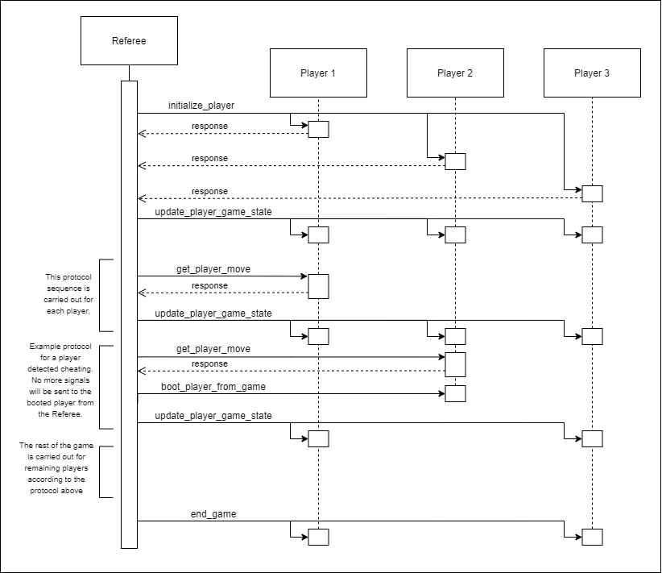

## Player Protocol

The Referee will poll players for responses via the PlayerInterface API as defined in [our documentation](player-interface.md). This api can be called directly or over tcp in the future.  

It is assumed that a player will exist and support the API before a referee begins to call it.

First, the referee will initialize players and give them their initial cards, rails, and destinations. The referee will:
* call initialize_player() on each player
* after all players are initialized, call update_player_game_state() on each player

At this point, every player will have the requisite state, to begin the game and the referee will ask for player moves in the order that the referee implements(age or whaterver proxy value is used). This loop coninues until the end condition is reached.
* call get_player_move() on the current player  
* If a player "cheats", call boot_player_from_game()
, otherwise, the referee will update its internal state
* after each turn, call update_player_game_state() on each player (or observer) with the level of visibility that they posess.
* At this point, the referee will check for the end condition

Once the end condition has been detected by the referee, players will be notified over update_player_game_state(), and last turns will be made.
* call end_game_for_player() when the game is over

### UML Sequence Diagram
The following UML diagram showcases the above description:
