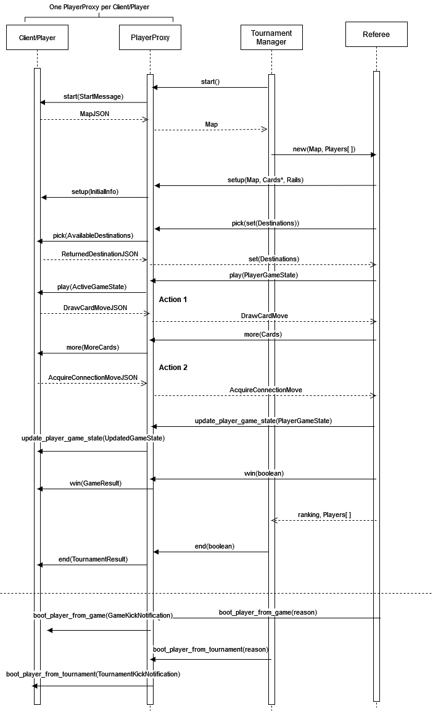

## Protocol Diagram

## Explanation

\*Note: The following explanation focuses on the remote communication between the administrators and the players.

All communications between the server's administrative components (i.e., the Tournament Manager and the Referee) and each client (player) go through a single `PlayerProxy` per player. The client uses the `PlayerProxy` to connect their Player logical components to the server.

The tournament begins when the Tournament Manager calls the `start` method on each `PlayerProxy`. The proxy then calls start on the player with a `StartMessage` JSON, containing a message that the tournament has started. The Player responds with a suggested map of its choosing. It returns a `MapJSON` to the proxy, which in turn returns a Map object to the Tournament Manager with data imported/parsed from the player's JSON.

Players are then assigned to games as normal.

For each player in a game, the Referee will begin by calling the `setup` method of each `PlayerProxy`. The proxy will call `setup` on each player, the input being an `InitialInfo` JSON containing the game map, as well as the initial hand and rails of the player.

During this phase the Referee will also ask each player to choose destinations, calling the `PlayerProxy` `pick` method. This will call `pick` on the player with a
JSON containing the destinations available (denoted by `AvailableDestinations`), to which the player will return the destinations it did not choose to the proxy in the form of a `ReturnedDestinationJSON`. This will be in the same format as `AvailableDestinations`.

During the game, the Referee calls `play` on the proxy corresponding to the active player. This will call the player's `play` method, handing it `ActiveGameState`, a JSON representation of the player's
current knowledge of the game. In response, one of the two following interactions occurs:

-   The player returns a `DrawCardMoveJSON`, which the `PlayerProxy` will translate into a `DrawCardMove` object and return it to the referee. The referee will then call `more` on the `PlayerProxy`, and the proxy will call the player's `more` method with a `MoreCards`, a JSON object containing the number of each colored card the player has received.

-   The player returns an `AcquireConnectionMoveJSON`, which is a JSON object containing a representation of a connection. The `PlayerProxy` translates this into an `AcquireConnectionMove`, and if legal, the Referee allows the player to acquire it.

After each turn is taken, the Referee will call `update_player_game_state` on each `PlayerProxy`, handing it the new PlayerGameState representing changes made during the turn.

When the game is over, the Referee will call each proxy's `win` method, which will call `win` on the player with a `GameResult`. This is a JSON message informing the player whether it won or lost the game.

When all games have been played, the Tournament Manager will call the `end` method on each `PlayerProxy`, which will call `end` on the player and send them a `TournamentResult` JSON message informing them whether they have won the tournament or lost.

Finally, if at any point a player misbehaves during the proceedings described above, the Referee or the Tournament manager can boot the player. Booted players will be notified with either a `GameKickNotification` or a `TournamentKickNotification`, which are both JSON messages informing the player that they have been kicked, as well as the reason why.
